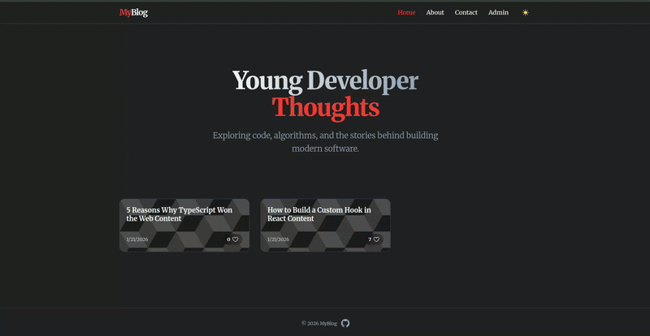

# Blog Application

A full-stack blog platform featuring a public reader interface and an admin dashboard for content management. This project is part of my full-stack learning journey; it was built before I learned Prisma, so I wrote plain SQL queries, which made me appreciate Prisma and ORMs in general. I also integrated TinyMCE, a rich text editor with many features.

## Tech Stack

